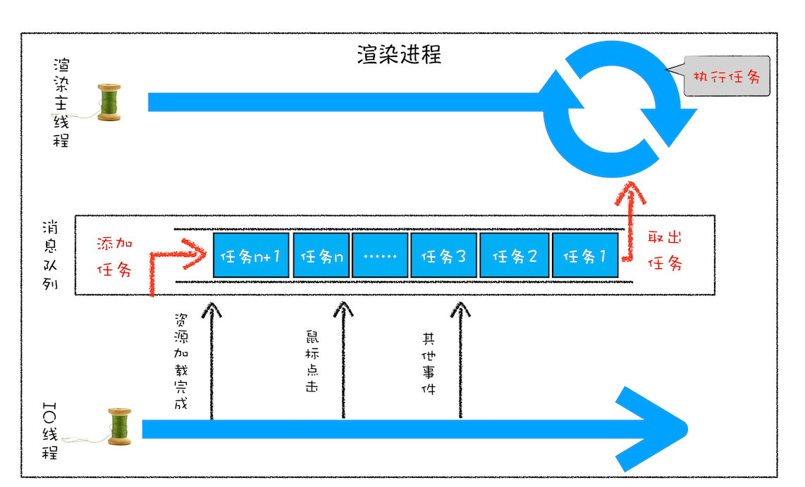

# Promise

官方文档:[点击访问](https://promisesaplus.com/)

## 细节

Promise A+ 规范首先定义了 Promise 的一些相关术语和状态。

### Terminology，术语

1. “promise” ，一个拥有 `then` 方法的对象或函数，其行为符合本规范
2. “thenable”，一个定义了 `then` 方法的对象或函数
3. “value”，任何 JavaScript 合法值（包括 `undefined`， `thenable` 和 `promise`）
4. “exception”，使用 `throw` 语句抛出的一个值
5. “reason”，表示一个 `promise` 的拒绝原因

### State，状态

promise 的当前状态必须为以下三种状态之一：`Pending`， `Fulfilled` ， `Rejected`

- 处于 Pending 时，promise 可以迁移至 Fullfilled 或 Rejected
- 处于 Fulfilled 时，promise 必须拥有一个不可变的终值且不能迁移至其他状态
- 处于 Rejected 时，promise 必须拥有一个不可变的拒绝原因且不能迁移至其他状态